<div align="center">

<!-- PORTRAIT + TERMINAL HERO SECTION -->
<table>
<tr>
<td width="42%" align="center" valign="top">

<!-- PORTRAIT - generated by scripts/dotify.py from id card.jpg
     Color dot-matrix with reveal animation -->


</td>
<td width="58%" align="center" valign="top">

<!-- TERMINAL - generated by scripts/terminal.py
     Multi-color animated terminal card with row-by-row reveal -->


</td>
</tr>
</table>

<!-- SOCIALS -->
<a href="https://instagram.com/_kushalparakh"></a>
<a href="https://linkedin.com/in/kushalparakh"></a>
<a href="mailto:parakhkushal1@gmail.com"></a>
<a href="https://github.com/Jeeerryyy"></a>

<br><br>

> *"I Love how my life gives me a plot twist every month!!!"*  
> — **jeeerryyy**

<br>


</div>

---

## `~/` whoami

```console
jerry@nirvanaa:~$ cat about.txt
```

B.Tech IT student at **Walchand Institute of Technology, Solapur**.
Co-run **Nirvanaa Studios**, building full-stack products for regional businesses.
Cybersecurity on the side — CTFs, bug bounty, the odd ESP32 build.

- 🔭 Currently building products under **Nirvanaa Studios** *(and breaking them to see what happens)*
- ☕ Converting caffeine into code that works on the first try *(which honestly terrifies me)*
- 🐛 Writing bugs so sophisticated that clients call them *"exclusive features"*
- ⚡ Fun fact: **I started coding because I wanted to build things nobody else would build for my city.**

<br>

<div align="center">

## `~/` toolbox


</div>

---

<div align="center">

## `~/` selected work

</div>

```console
jerry@nirvanaa:~$ ls -la ~/projects/
```

#### `journey-rentals/`
Self-drive car & hourly bike rentals in Solapur, built around railway-station handovers and temple-circuit routes — Akkalkot, Tuljapur, Pandharpur. SEO/GEO-optimized end to end.
`React` `Node.js` `MongoDB` · [journeyrentals.in](https://journeyrentals.in)

#### `second-homez/`
Curated, Airbnb-style villa marketplace for Goa — multi-room inventory, Razorpay checkout, iCal sync across OTAs.
`Next.js` `NestJS` `PostgreSQL` `Redis`

#### `hospital-hms/`
Multi-branch hospital management system — 19 role-based panels, family/dependent patient accounts, in-person and video-consult appointment booking.
`Full-stack` `Healthcare`

#### `aarogyamitra/` — Smart India Hackathon 2026
Improving access to public healthcare across rural Maharashtra, built with Team Aarohan.
[GitHub](https://github.com/Jeeerryyy/SIH2026)

*+ a dozen more shipped under Nirvanaa Studios — rentals, hospitality, fitness, wellness.*

---

<div align="center">

## `~/` connect

```
jerry@nirvanaa:~$ echo $LINKS
```

[](https://instagram.com/_kushalparakh)
[](https://linkedin.com/in/kushalparakh)
[](mailto:parakhkushal1@gmail.com)

**Build. Break. Learn. Share.**

</div>
